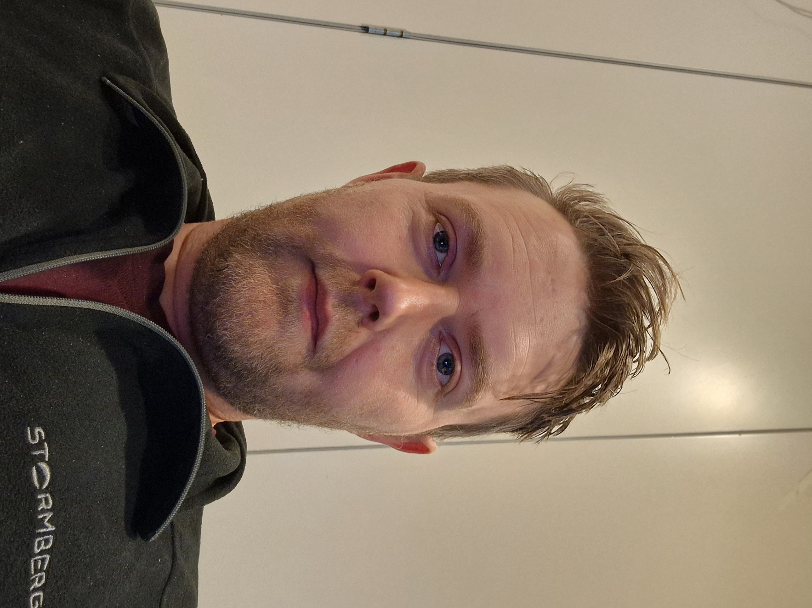

#                        

## Introduction 

- I`m Alex, im currently a backend student at jobloop.
- my passion is C# and working with API`s, .NET, SQL etc.
- My goals are to improve my knowledge and myself as a person.

**Contact information**

## Skills

  
  
  
  
  
  
  
  
  
  
  

###

