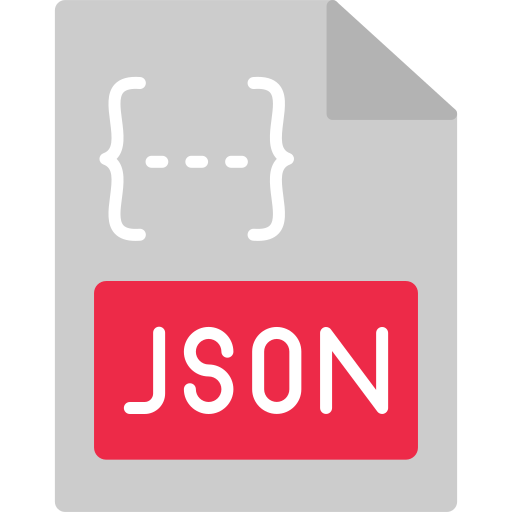

# 

## Introduction

Hi, I’m Alex, a backend development student at Jobloop with a strong passion for making efficient and secure software solutions.
I specialize in C#, .NET, and building robust APIs integrated with SQL databases.

I have a particular interest in:

- **Encryption and Security:** Exploring techniques like hashing, salting, and file encryption.
- **Data Handling:** From serialization (ex, JSON) to real-time data processing.
- **Machine Learning:** Experimenting with ML.NET for clustering, sentiment analysis, and anomaly detection.
- **Windows Forms Development:** Creating user-friendly desktop applications with engaging interfaces.
- **Game Development:** Building fun projects like Snake, Breakout, and Connect 4, using C#.

Outside of coding, I enjoy 3D printing, using CAD tools to design custom creations for printing on my 3D printer.

My goal is to continuously enhance my skills in backend development, security, and machine learning, while also exploring new technologies like desktop and web application development. Feel free to explore my projects and reach out—I’m always open to learning and collaboration!

## Contact Information

&nbsp;&nbsp;&nbsp;

&nbsp;&nbsp;&nbsp;

## Skills

### Languages
           

### Frameworks & Tools 
                        

### Platforms
              

## GitHub Stats

## Featured Projects

### [Project 1: HockeyclubAPI](https://github.com/bax082024/HockeyClubAPI)
- Challenge for myself to implement authentication and authorization for different user classes.

### [Project 2: Calculator](https://github.com/bax082024/CalculatorBasic)
- Basic calculator with add, subtract, multiply and divide function

### [Project 3: Magic 8 Ball](https://github.com/bax082024/Magic-8-Ball-JS.git)
- Old school magic 8 ball to help make decisions.

### [Project 4: DrivinGame](https://github.com/bax082024/DrivinGame-)
- This is a driving game made for the terminal.

### [Project 5: MovieDatabaseAPI](https://github.com/bax082024/MovieDataBaseAPI)
- Movie database i made to practice coding.

## Acknowledgemnts:
Icons from : https://icons8.com/icons/set/github
